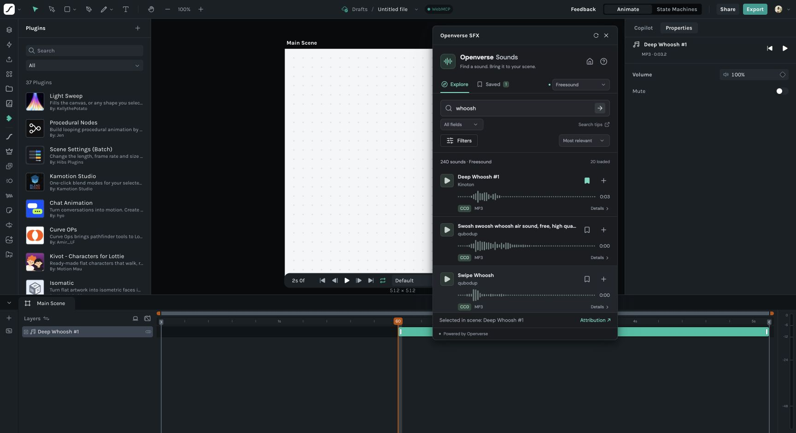

# Openverse SFX

Find, preview, and add sound effects to your animation without leaving LottieFiles Creator. Start with Freesound, explore other Openverse sources, and save your favorites for later.

**[Get Openverse SFX on Creator Extensions](https://extensions.lottiefiles.com/plugin/karthikeyan-ranasthala/openverse-sfx)** · [Report a bug](https://github.com/KarthikeyanRanasthala/creator-plugin-openverse-sfx/issues) · [Contribute](CONTRIBUTING.md)



## Use the plugin

1. Open the [marketplace listing](https://extensions.lottiefiles.com/plugin/karthikeyan-ranasthala/openverse-sfx) and select **Open in Creator**.
2. Search for a sound, or try a sound idea such as a whoosh or impact.
3. Preview it, check its license, and select **Add** to place it in your scene.

No Openverse account or API key is required.

## Features

- Search Freesound and other Openverse audio sources by title, creator, tags, or all fields.
- Filter by duration, license, intended use, and file format.
- Listen with waveform previews, seeking, volume, mute, and looping.
- Bookmark sounds and find them again in the same browser.
- Add audio at the playhead or scene start, and optionally extend the scene to fit.
- View source and license details, with attribution kept on the added audio layer.

Use Creator to adjust timing, volume, and fades after adding a sound. Supported files are **MP3, WAV, M4A, FLAC, and OGG**, up to **20 MB**. Some files may be unavailable from their original provider; the sound's details include a link to its source.

Each sound has its own license. Check its terms before using it, especially for commercial projects or edits. The plugin's MIT license does not license the audio assets.

## Saved sounds and privacy

Favorites stay in this browser and do not sync across devices. Searches and audio files are loaded from Openverse and the original providers. The plugin has no built-in analytics. See [data and privacy](docs/PRIVACY.md) for details.

## Develop locally

Use **Node.js 22.18+ or 24+** and npm.

```sh
git clone https://github.com/KarthikeyanRanasthala/creator-plugin-openverse-sfx.git
cd creator-plugin-openverse-sfx
npm ci
npm run dev:ui -- --port 5173 --strictPort
```

Open `http://127.0.0.1:5173/` for a standalone preview. To test scene insertion and persistent bookmarks, open [LottieFiles Creator](https://creator.lottiefiles.com/), go to **Plugins → + → Develop**, and enter `http://127.0.0.1:5173`.

```sh
npm test
npm run lint
npm run build
```

The build writes `dist/manifest.json`, `dist/plugin.js`, and `dist/ui.html`. This is a browser-only app; there is no server to deploy. See [development notes](docs/DEVELOPMENT.md) for the architecture and host requirements.

## Releases and walkthrough

**Version 1.0.0** is [published on Creator Extensions](https://extensions.lottiefiles.com/plugin/karthikeyan-ranasthala/openverse-sfx). See the [changelog](CHANGELOG.md) and [silent walkthrough](docs/videos/openverse-simplified-flow.mp4).

The exact submitted ZIP is preserved in [`releases/creator-plugin-openverse-sfx-1.0.0.zip`](releases/creator-plugin-openverse-sfx-1.0.0.zip). [Marketplace notes](docs/marketplace/LISTING.MD) record the listing and bundle hash. Live Creator verification covers search, previews, import, scene playback, saved sounds, and attribution.

## Contributing

Bug reports, feature suggestions, and pull requests are welcome. Read [CONTRIBUTING.md](CONTRIBUTING.md) before making a change. [PRD.MD](PRD.MD) describes the product scope; [WORKLOG.MD](WORKLOG.MD) records decisions and verification.

## License and credits

The plugin code is available under the [MIT license](LICENSE), copyright © 2026 Karthikeyan Ranasthala. Third-party dependencies retain their own licenses; see [third-party notices](docs/marketplace/THIRD-PARTY-NOTICES.txt).

Built with [Openverse](https://openverse.org/), [LottieFiles Creator](https://creator.lottiefiles.com/), React, and Vite. Openverse SFX is an independent community plugin.
